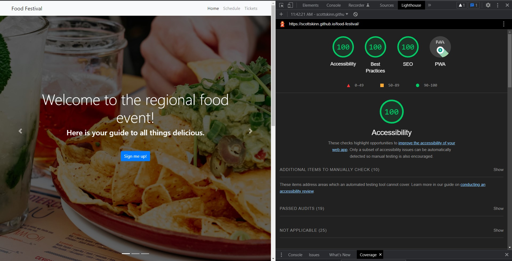

# Food Festival

## Table of Contents

- [Description](#description)
- [Installation](#installation)
- [Usage](#usage)
- [Contributing](#contributing)
- [License](#license)
- [Tests](#tests)
- [Questions](#questions)

## Description

    Convert an existing web application to a PWA and make it more performant and efficient and optimizing it for use on mobile devices. I used lighthouse audits the maximize the apps performance.

    Food events in near you.

## Installation

    Visit live site:

<https://scottskinn.github.io/food-festival/>

## Usage

## Contributing

    Feel free to add more events. 

## License

  

## Questions

    You can reach me by email or check out my github!

[scottskinn](https://github.com/scottskinn/)

[scottskinn2n@gmail.com](mailto:scottskinn2n@gmail.com)
